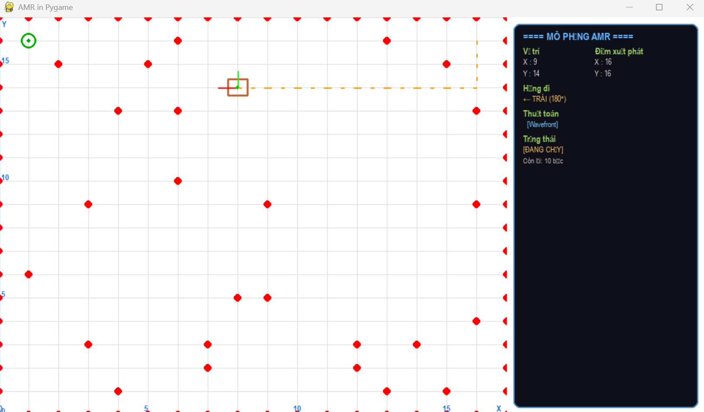
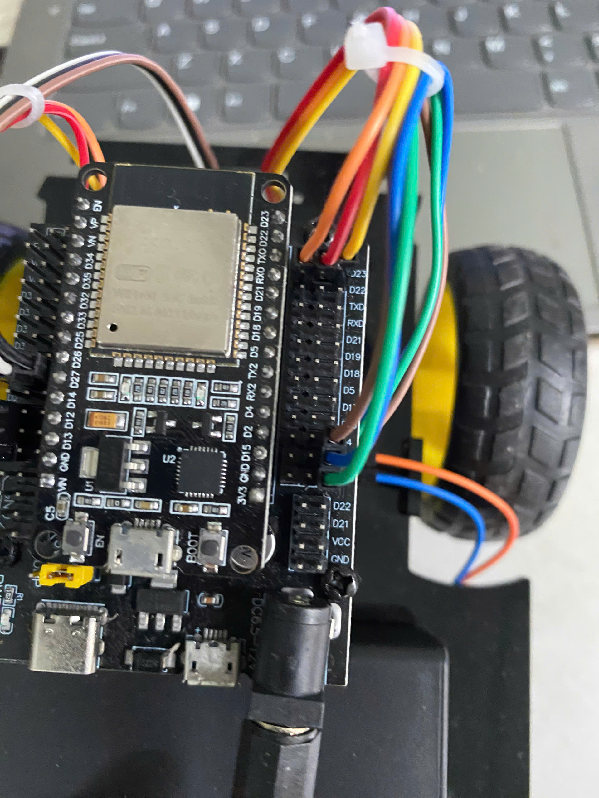

# AMR Wavefront Path Planning — ESP32 Autonomous Mobile Robot

## Project Overview

A 2D simulation of an Autonomous Mobile Robot (AMR) that plans and follows a path around obstacles using the **Wavefront** algorithm, with optional control of a real ESP32-based robot over WiFi.

## System Architecture

**1. PC Simulation (Client)**
- Generates a randomized grid map with static obstacles.
- Computes the path using the **Wavefront** algorithm.
- Visualizes the map, robot, and path using **Pygame**.
- Sends motor commands via **UDP Sockets**.



**2. Physical Robot (Server/Edge)**
- **MCU:** ESP32 acting as a Wi-Fi Access Point (`192.168.4.1`).
- **Control:** Parses single-character commands to drive DC motors via motor driver.
- **Feedback:** Uses interrupt-based **Encoder** readings with **PI speed control**.
- **Safety:** Automatically stops the robot if commands stop arriving (timeout).



### Hardware Components

| Component | Description |
|---|---|
| Microcontroller | ESP32 DEVKIT V1 — WiFi Access Point + control unit |
| Motor Driver | L298N H-bridge module |
| Motors | 2x DC gear motors (differential drive) |
| Encoders | 2x single-channel encoders (right: GPIO 22, left: GPIO 26) |
| Power | 2x 18650 Li-ion cells (3.7V, in series) for the motor driver; 5V supply for the ESP32 |
| Chassis | 2-wheel differential-drive robot chassis |

## Requirements

- Python 3.10+
- Dependencies:
  ```
  pygame>=2.5.0
  numpy>=1.24.0
  ```

## Repository Structure

```
├── AMR_wavefront/            # PC simulation (Python + Pygame)
│   ├── core/                 # Application loop, map, robot, graphics, input
│   ├── component/             # Sensor, Wavefront processor, actuator
│   ├── utils/                 # Coordinate conversion helpers
│   └── test.py                # Entry point
├── Code_firmware/
│   └── firmware_esp32.py      # MicroPython firmware for the ESP32
└── README.md
```

